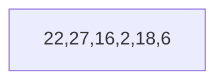
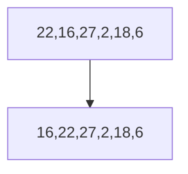
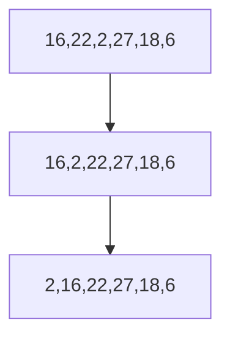
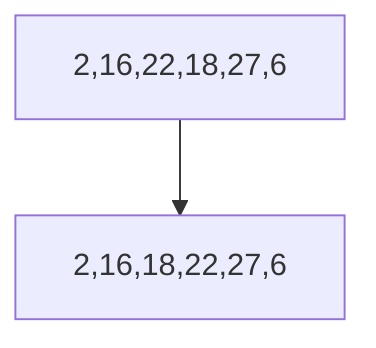
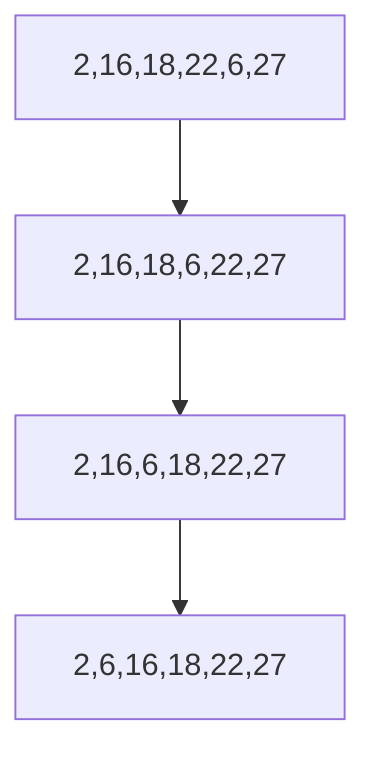

# Proje-1 | Insertion Sort

[Patika.dev](https://www.patika.dev/tr)

Projede kullanılacak array -> [22,27,16,2,18,6]

**1. aşama: Yukarıda verilen dizinin sort türüne göre aşamalarını yazınız.**

Dizinin elemanları üzerinde sırasıyla ilerlenir. Başlangıçta ilk elemana dokunulmadan aynen bırakılır. Bir sonraki(bir sağdaki) elemana geçildikten sonra ilk eleman ve ikinci eleman kıyaslanır.
İlk eleman ikinci elemandan küçük ise bir değişiklik yapılmadan ikinci elemandan üçüncü elemana geçilerek kıyaslama ve sıralama işlemine devam edilir.
İlk eleman ikinci elemandan büyük ise ikinci eleman ilk elemanın önüne(soluna) alınır. Bu işleme üçüncü elemanın sırasıyla ikinci ve ilk elemanla kıyaslanması ile devam edilir.  Her kıyaslamada küçük olan eleman büyük olan elemanın önüne(soluna) alınır. Bütün elemanları kıyaslayana kadar kıyaslama ve yer değiştirme işlemine devam edilir.


Başta ilk elemana dokunmadan aynen bırakırız. Bu dizinin ilk elemanı 22'dir ve bu elemanı aynen bırakırız sonrasında kıyaslama işlemi için ikinci elemana bakarız.
|1.Adım|     
|------|




Birinci veri olan 22'yi ve ikinci veri olan 27'yi karşılaştırırız. 22, 27'den küçük olduğu için herhangi bir değişiklik yapmayız.

|2.Adım|
|------|


Birinci ve ikinci veriyi kıyasladıktan sonra üçüncü veri olan 16 ile bir öncesindeki veri olan 27'yi kıyaslarız 16, 27 den küçüktür, bu yüzden 16 ile 27 yer değiştirir. Kıyaslama işlemine 16 ve 22 verilerini kıyaslayarak devam ederiz. 16, 22 den de küçüktür, bu yüzden 16 ile 22 yer değiştirir.


|3.Adım|
|------|



Üçüncü veriyi kendinden önceki verilerle kıyasladıktan sonra, dördüncü veri olan 2'yi kendinden önceki verilerle sırayla kıyaslarız. 2, 27'den küçüktür, bu yüzden 2 ile 27 yer değiştirir yani swap yapar. 2, 22'den de küçüktür, bu yüzden 2 ile 22 yer değiştirir yani swap yapar. 2, 16'dan da küçüktür, bu yüzden 2 ile 16 yer değiştirir yani swap yapar.
|4.Adım|
|------|




Dördüncü veriyi kendinden önceki verilerle kıyasladıktan sonra, beşinci veri olan 18'i kendinden önceki verilerle sırayla kıyaslarız. 18, 27'den küçüktür, bu yüzden 18 ile 27 yer değiştirir yani swap yapar. 18, 22'den de küçüktür, bu yüzden 18 ile 22 yer değiştirir yani swap yapar. 18, 16'dan büyüktür, bu yüzden herhangi bir değişiklik yapılmaz.
|5.Adım|
|------|



Beşinci veriyi kendinden önceki verilerle kıyasladıktan sonra, altıncı ve son veri olan 6'yı kendinden önceki verilerle sırayla kıyaslarız. 6, 27'den küçüktür, bu yüzden 6 ile 27 yer değiştirir yani swap yapar. 6, 22'den de küçüktür, bu yüzden 6 ile 22 yer değiştirir yani swap yapar. 6, 18'den de küçüktür, bu yüzden 6 ile 18 yer değiştirir yani swap yapar. 6, 16'dan daküçüktür, bu yüzden 6 ile 16 yer değiştirir yani swap yapar. 6, 2'den büyüktür, bu yüzden herhangi bir değişiklik yapılmaz.
|6.Adım|
|------|



**2. aşama: Big-O gösterimini yazınız.**

O(n^2)


**3. aşama: Time Complexity:**

- Average case: Aradığımız sayının ortada olması,
Worst case ile best casein ortalamasını aldığımızda n^2 olarak buluruz.

- Worst case: Aradığımız sayının sonda olması,
Tam ters verilmiş dizi, bu durumda dizinin her bir elemanı bir gerisindekinden küçük olacaktır. Dolayısıyla birinci eleman için iç döngü 0 2 eleman için geriye doğru 1, 3. eleman için iki daha sonra 3 4 5 6… n kadar geriye hareket yapacaktır. Yani 0+1+2+3+4…..+n-1 = [n*(n-1)]/2 : n^2

- Best case: Aradığımız sayının dizinin en başında olması.
Tam sıralı dizi, n tane sayinin üzerinden birer defa geçer ve hiç birini geriye doğru ilerletme gereği olmadığı için bu tek geçişle kalır. Yani n

**4. Dizi sıralandıktan sonra 18 sayısı hangi case kapsamına girer? Yazınız.**

Veri setinin ortasında olduğu için average case kapsamına girer.


# ŞİMDİ DE 2 BÖLÜMDEN OLUŞAN PROJEMİZİN İKİNCİ BÖLÜMÜNE GEÇELİM :)

Projede kullanılacak array -> [7,3,5,8,2,9,4,15,6]

**2. [7,3,5,8,2,9,4,15,6] dizisinin Insertion Sort'a göre ilk 4 adımını yazınız.**

 |1.Adım|   
 |------|
 
 ```mermaid
graph TD;
   7,3,5,8,2,9,4,15,6;
```
 
 |2.Adım|     
 |------|
 
  ```mermaid
graph TD;
   3,7,5,8,2,9,4,15,6;
```
 
 |3.Adım|     
 |------|
 
   ```mermaid
graph TD;
   3,5,7,8,2,9,4,15,6;
```
 
 |4.Adım|      
 |------|
 
   ```mermaid
graph TD;
   3,5,7,8,2,9,4,15,6;
```
