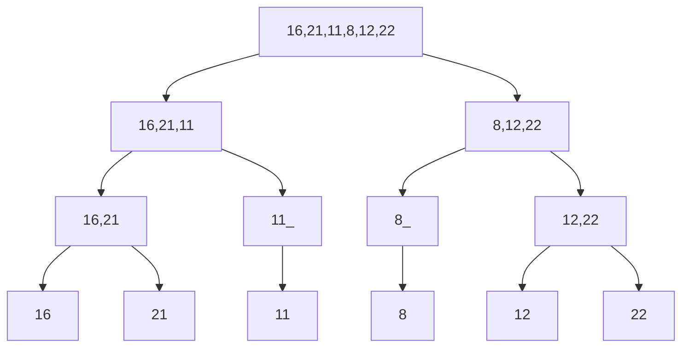
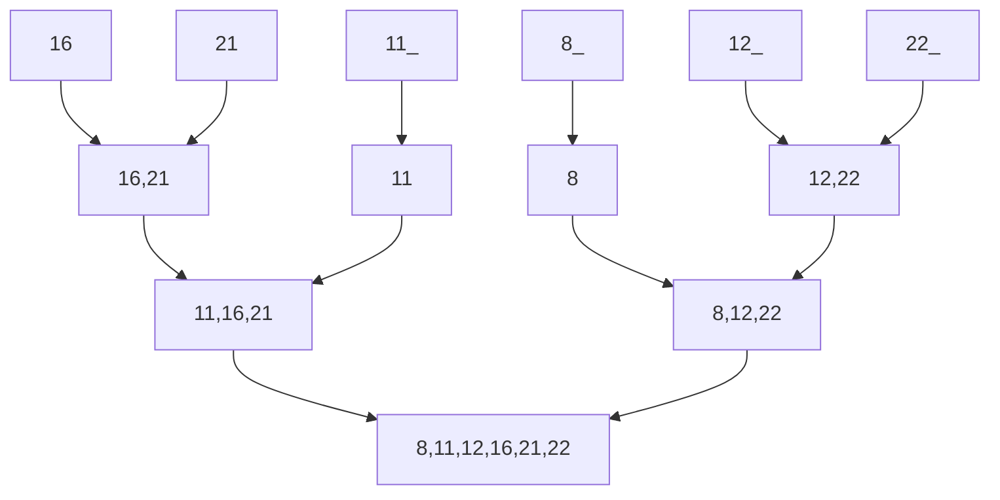

# Proje-2
### [16,21,11,8,12,22] -> Merge Sort

#### 1. Yukarıdaki dizinin sort türüne göre aşamalarını yazınız.
#### İlk olarak dizimizi ikiye bölüyoruz. Böldüğümüz dizileri tekrar bölüyoruz. Tek eleman kalana kadar bu işleme devam ediyoruz.

Diziyi ikiye bölerek yeniden yazıyoruz => Sol ve sağdaki dizileri tekrar ikiye böluyoruz => Tek eleman kalana kadar bu işleme devam ediyoruz. 

####  Bölme işlemi bitikten sonra, tek elemanlı dizilerimizi ikili ikili birleştiriyoruz. Sıralı dizi elde edinceye kadar bu işleme devam ediyoruz.

ikili ikili ikili sıralayarak birleştiriyoruz => Tekrar ikili ikili sıralayarak birleştiriyoruz => Son birleştirmede dizimizi elde ediyoruz.

#### 2. Big-O gösterimini yazınız.
Recursive bir fonksiyon olduğu için sürekli kendini çağırarak diziyi hep ikiye bölmektedir. Her bölünmüş dizinin Merge işlemi için de dizinin uzunluğu olan n işlem yapıldığından O(n*(logn)) --> O(6*(log6)) olacaktır.
