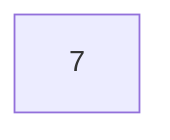
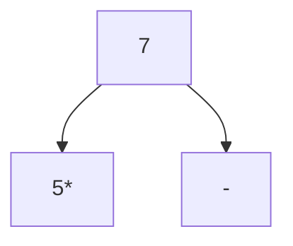
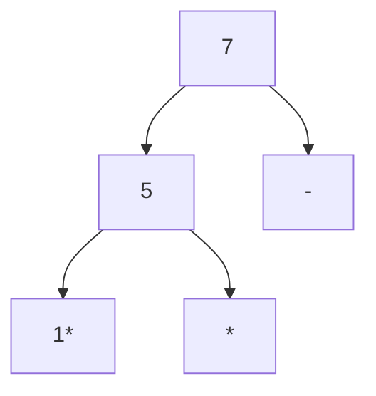
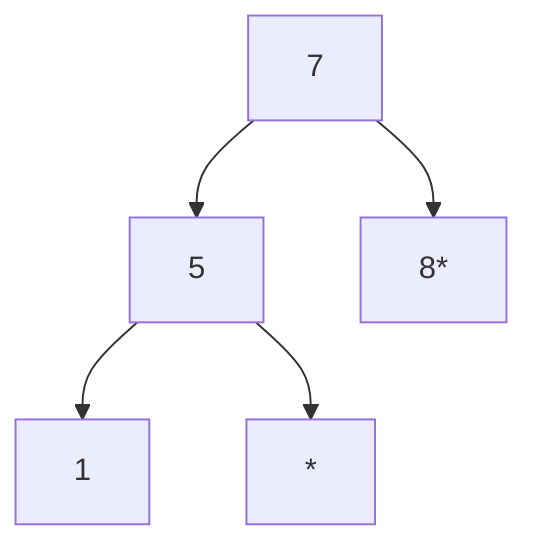
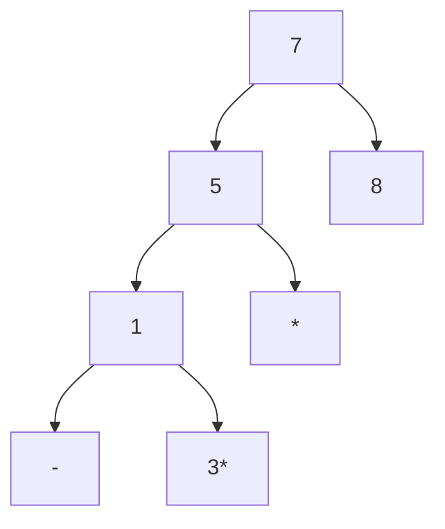
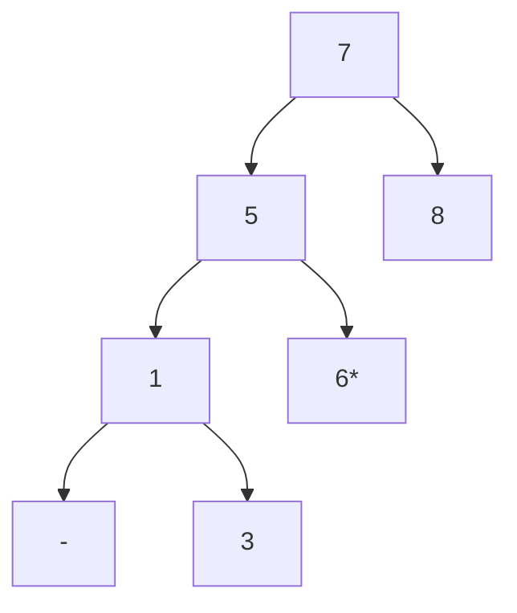
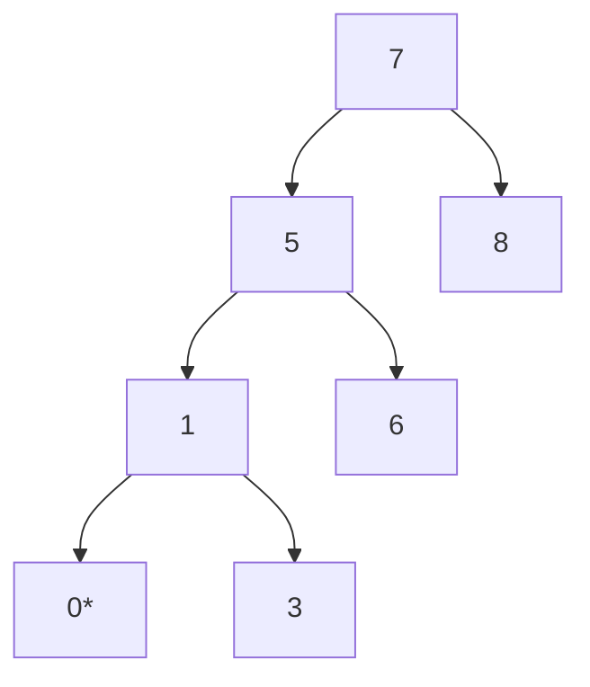
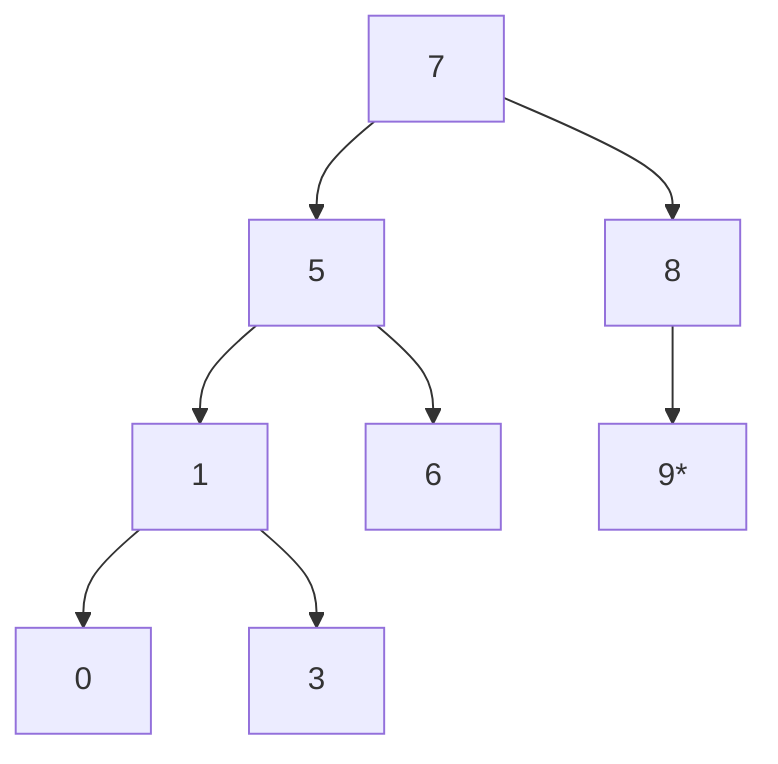
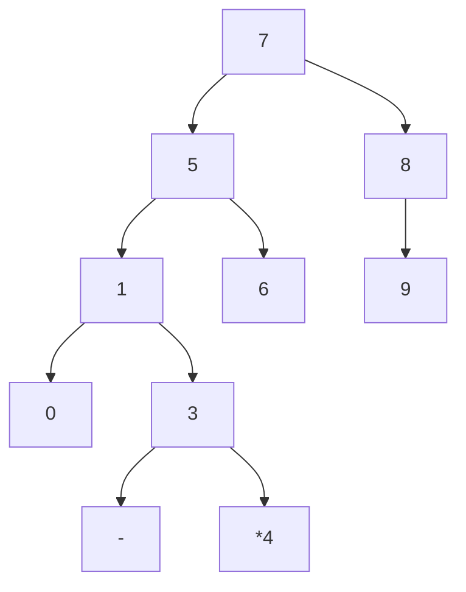
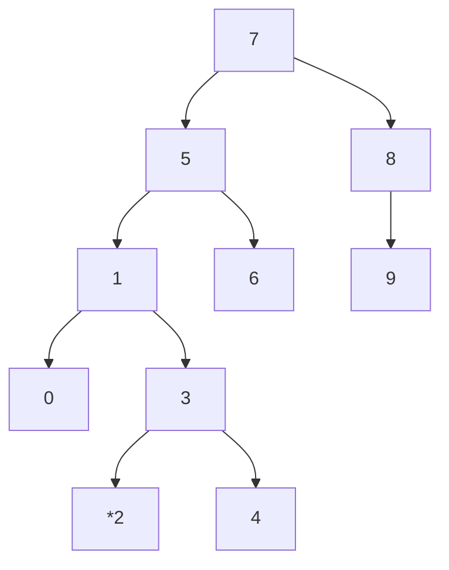

# Proje-3

[Patika.dev](https://www.patika.dev/tr)

### [7, 5, 1, 8, 3, 6, 0, 9, 4, 2] dizisinin Binary-Search-Tree aşamalarını yazınız.
##### İkili arama ağacı, her düğümün solundaki koldan ulaşılabilecek bütün verilerin düğümün değerinden küçük, sağ kolundan ulaşılabilecek verilerin değerinin o düğümün değerinden büyük olmasını şart koşar.

|   Görsel  Açıklama    |
|--               |

## **root=7**       

**5 sayısı 7'den küçük olduğunda 7'nin soluna ekledik.**
|   Görsel  Açıklama    |
|--           |

## **5 ekledik**

**1 sayısı 5'ten ve 7'den küçük olduğunda 7 ve 5'in soluna ekledik.** 
|   Görsel  Açıklama    |
|--             |

## **1 ekledik**

**8 sayısı 7'den büyük olduğunda 7'nin sağına ekledik.** 
|   Görsel  Açıklama    |
|--             |

## **8 ekledik**

**3 sayısı  7'den ve 5'ten küçük  olduğunda 5'in soluna, 1'den büyük olduğunda 1'in sağına ekledik.**  
|   Görsel  Açıklama    |
|--             |

## **3 ekledik**

**6 sayısı 7'den küçük  olduğunda 7'nin soluna, 5'ten büyük olduğunda 5'in sağına ekledik.**  
|   Görsel  Açıklama    |
|--             |

## **6 ekledik**

**0 sayısı  7'den, 5'ten ve 1'den küçük  olduğunda 1'in soluna ekledik.**  
|   Görsel  Açıklama    |
|--              |

## **0 ekledik**

**9 sayısı  7'den ve 8'den büyük olduğunda  8'in sağına ekledik.**  
|   Görsel  Açıklama    |
|--            |

## **9 ekledik**

**4 sayısı  7'den ve 5'ten küçük olduğunda 5'in soluna, 1'den ve 3'ten büyük olduğunda 3'ün sağına ekledik.** 
|   Görsel  Açıklama    |
|--           |

## **4 ekledik**

**2 sayısı  7'den ve 5'ten küçük olduğunda 5'in soluna, 1'den büyük olduğunda 1'in sağına ve 3'ten küçük olduğunda 3'ün soluna ekledik.** 
|   Görsel  Açıklama    |
|--           |

## **2 ekledik**
